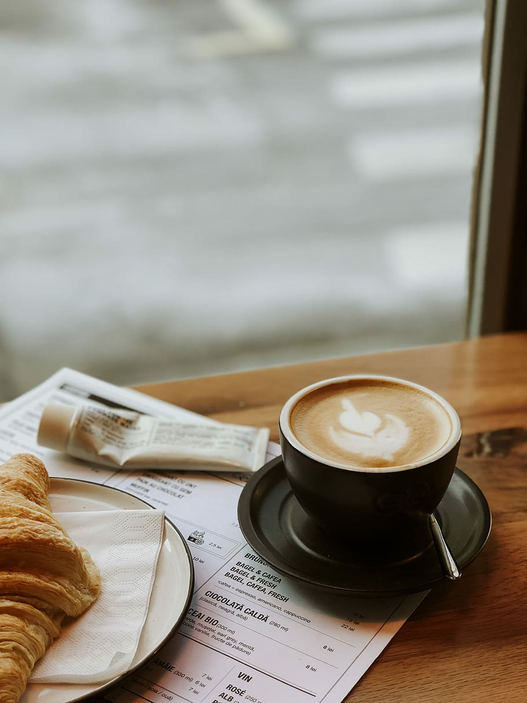
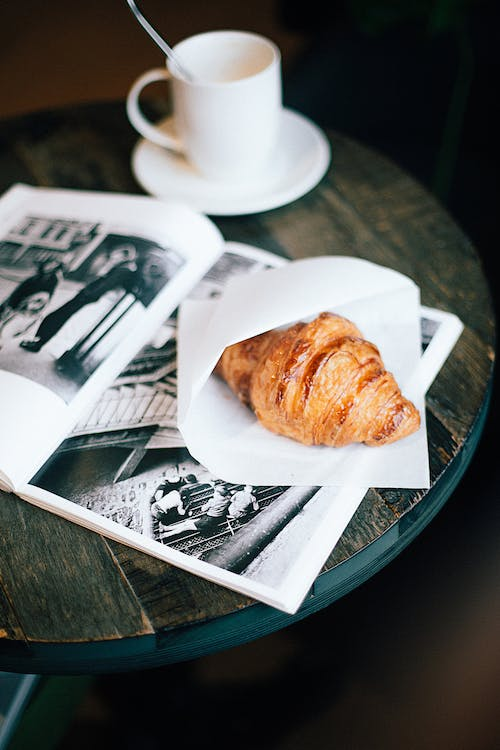
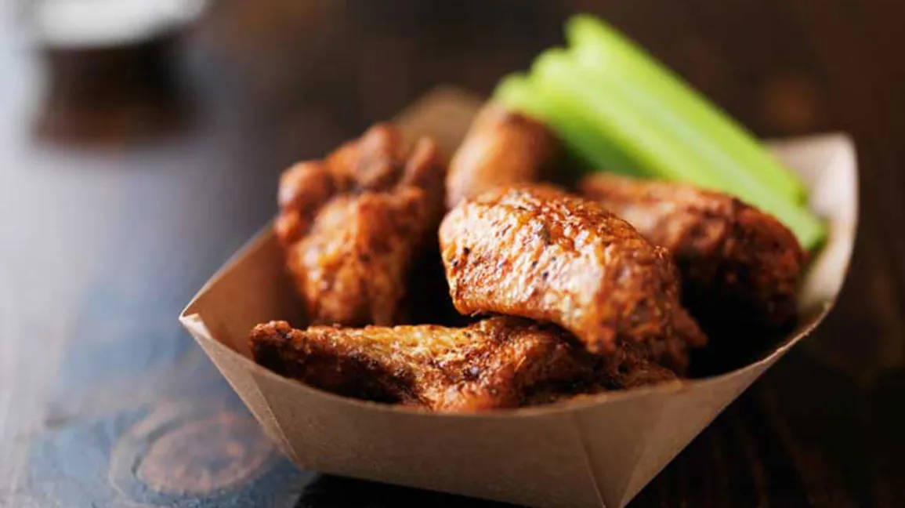

# Cozy-Cup-Cafe

## Project Description

Located in a quaint area of the busy city, the intimate cafe radiates coziness and a friendly atmosphere that instantly envelops its customers. A soft bell alerts you to arrival as you enter through the warm glass entrance, and the aroma of freshly made coffee and delicious pastries entices your senses.

## Features

- Cozy Music
- Friendly Staff
- Eco Friendly Environment

## Screen Captures

This cappucino is created with a fresh grain of coffee and milk

This is a Croissant that is freshly baked at the cafe

This Ham and Cheese sandwich is grilled for extra flavour

This is a bite size chicken that is tasty and flavored with our own made marinating sauce

## About the Authors

**Name:** Kier Wilson M. Familaran  
**Email:** kier.familaran@gmai.com

